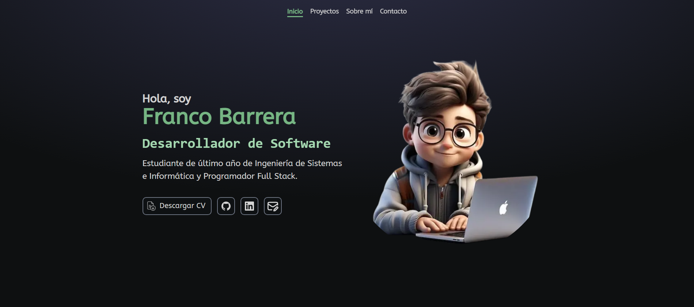

# Portafolio Personal 🌐

Este es mi portafolio personal, desarrollado con tecnologías modernas para destacar mis habilidades como desarrollador.

### 🌟 Características

- **Framework**: [Astro](https://astro.build/) para un rendimiento optimizado.
- **Estilo**: Diseño responsivo utilizando [TailwindCSS](https://tailwindcss.com/).
- **Lenguajes**: Implementado en **TypeScript** y **JavaScript** para un código limpio y mantenible.
- **Interactividad**: Funcionalidades dinámicas usando JavaScript.
- **Accesibilidad**: Diseño accesible y compatible con dispositivos móviles.

---

## 📷 Vista Previa



> **Nota:** Imagen del proyecto

---

## 🚀 Instalación y Uso

Sigue estos pasos para correr el proyecto localmente:

### 1. Clonar el Repositorio

```bash
git clone https://github.com/tu-usuario/tu-repositorio.git
cd tu-repositorio
```

### 2. Instalar Dependencias

```npm install

```

### 3. Ejecutar en Modo Desarrollo

```npm run dev

```

### 🛠️ Tecnologías Utilizadas

- **Astro**: Framework de desarrollo frontend.
- **TailwindCSS**: Librería de estilos CSS.
- **TypeScript**: Tipado estático para JavaScript.
- **JavaScript**: Para funcionalidades dinámicas.
- **HTML**: Estructura de la página.

## 📂 Estructura del Proyecto

La estructura de carpetas está diseñada para mantener el proyecto organizado y facilitar el desarrollo:

```plaintext
├── public/             # Archivos estáticos (imágenes, favicon, etc.)
├── src/
│   ├── components/     # Componentes reutilizables (Header, Footer, etc.)
│   ├── layouts/        # Plantillas de diseño general
│   ├── pages/          # Rutas del sitio
│   ├── styles/         # Estilos personalizados
│   └── scripts/        # Scripts personalizados
├── package.json        # Configuración de dependencias
├── tailwind.config.js  # Configuración de TailwindCSS
└── astro.config.mjs    # Configuración de Astro
```
